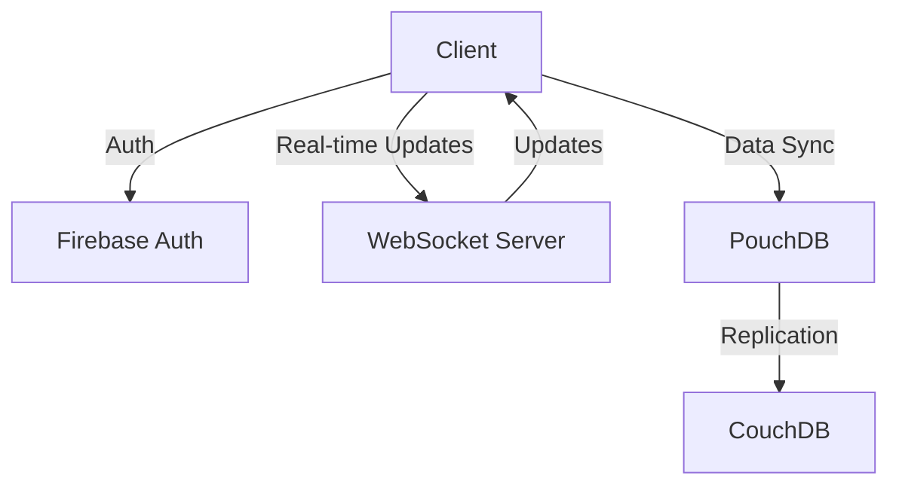

# Collaborative Drawing Board Documentation

## Table of Contents
- [Overview](#overview)
- [Getting Started](#getting-started)
- [Architecture](#architecture)
- [Authentication](#authentication)
- [Features](#features)
- [API Reference](#api-reference)
- [Development](#development)
- [Deployment](#deployment)
- [Troubleshooting](#troubleshooting)

## Overview

The Collaborative Drawing Board is a real-time, multi-user drawing application built with React, TypeScript, and PouchDB/CouchDB. It enables teams to collaborate on drawings in real-time with features like cursor tracking, shape drawing, and access control.

### Key Features
- Real-time collaboration
- Offline support
- Multi-tenant architecture
- Access control and sharing
- Real-time cursor tracking
- Vector-based drawing tools

## Getting Started

### Prerequisites
- Node.js (v16 or higher)
- npm or yarn
- CouchDB (v3.x)
- Firebase project

### Installation

1. Clone the repository:
```bash
git clone https://github.com/yourusername/collaborative-drawing-board.git
cd collaborative-drawing-board
```

2. Install dependencies:
```bash
npm install
```

3. Configure environment variables:
```bash
cp .env.example .env
```

Edit `.env` with your configuration:
```env
REACT_APP_FIREBASE_API_KEY=your_firebase_api_key
REACT_APP_FIREBASE_AUTH_DOMAIN=your_firebase_auth_domain
REACT_APP_FIREBASE_PROJECT_ID=your_firebase_project_id
REACT_APP_COUCHDB_URL=your_couchdb_url
REACT_APP_WEBSOCKET_URL=your_websocket_url
```

4. Start the development server:
```bash
npm start
```

## Architecture

### Technology Stack
- **Frontend**: React + TypeScript
- **Styling**: Tailwind CSS
- **Database**: PouchDB (client) / CouchDB (server)
- **Authentication**: Firebase Auth
- **Real-time**: WebSocket

### Data Flow


## Authentication

### Firebase Setup

1. Create a Firebase project
2. Enable Authentication methods:
   - Email/Password
   - Google
   - GitHub (optional)

### Implementation

```typescript
// Initialize Firebase
const firebaseConfig = {
  apiKey: process.env.REACT_APP_FIREBASE_API_KEY,
  authDomain: process.env.REACT_APP_FIREBASE_AUTH_DOMAIN,
  projectId: process.env.REACT_APP_FIREBASE_PROJECT_ID,
};

firebase.initializeApp(firebaseConfig);

// Auth state management
export const useAuth = () => {
  const [user, setUser] = useState<User | null>(null);

  useEffect(() => {
    return firebase.auth().onAuthStateChanged((user) => {
      setUser(user);
    });
  }, []);

  return { user };
};
```

## Features

### Drawing Tools

The application provides various drawing tools:

| Tool | Description | Shortcut |
|------|-------------|----------|
| Pen | Free-hand drawing | P |
| Rectangle | Draw rectangles | R |
| Circle | Draw circles | C |
| Line | Draw straight lines | L |
| Select | Select and modify shapes | S |
| Eraser | Remove shapes | E |

### Board Management

#### Creating a Board
```typescript
const createBoard = async (name: string) => {
  const board = {
    id: nanoid(),
    name,
    createdBy: user.email,
    createdAt: Date.now(),
    collaborators: [],
    isPublic: false
  };
  
  await db.put({
    _id: `board:${board.id}`,
    ...board
  });
};
```

#### Sharing a Board
```typescript
const shareBoard = async (boardId: string, email: string) => {
  const board = await db.get(`board:${boardId}`);
  board.collaborators.push(email);
  await db.put(board);
};
```

## API Reference

### Database Schema

#### Board Document
```typescript
interface Board {
  _id: string;          // Format: "board:{id}"
  type: 'board';
  name: string;
  createdBy: string;    // User email
  createdAt: number;    // Timestamp
  collaborators: string[];
  isPublic: boolean;
  lastModified: number;
  lastModifiedBy: string;
}
```

#### Shape Document
```typescript
interface Shape {
  _id: string;          // Format: "shape:{id}"
  type: 'shape';
  boardId: string;
  shapeType: 'pen' | 'rectangle' | 'circle' | 'line';
  points: Point[];
  style: ShapeStyle;
  createdBy: string;
  createdAt: number;
}
```

### REST Endpoints

#### Boards
- `GET /api/boards` - List user's boards
- `POST /api/boards` - Create new board
- `GET /api/boards/:id` - Get board details
- `PUT /api/boards/:id` - Update board
- `DELETE /api/boards/:id` - Delete board

#### Shapes
- `GET /api/boards/:id/shapes` - List shapes in board
- `POST /api/boards/:id/shapes` - Add new shape
- `PUT /api/shapes/:id` - Update shape
- `DELETE /api/shapes/:id` - Delete shape

## Development

### Project Structure
```
src/
├── components/        # React components
├── contexts/         # Context providers
├── hooks/           # Custom hooks
├── services/        # API and database services
├── types/           # TypeScript definitions
├── utils/           # Utility functions
└── App.tsx          # Root component
```

### Adding New Features

1. Create feature branch:
```bash
git checkout -b feature/your-feature-name
```

2. Implement feature following our conventions
3. Add tests
4. Submit pull request

### Testing

Run tests:
```bash
npm test
```

Run with coverage:
```bash
npm test -- --coverage
```

## Deployment

### Production Build
```bash
npm run build
```

### Docker Deployment
```bash
docker build -t drawing-board .
docker run -p 3000:3000 drawing-board
```

### Environment Configuration

Required environment variables for production:
- `NODE_ENV=production`
- `REACT_APP_FIREBASE_*` (Firebase configuration)
- `REACT_APP_COUCHDB_URL`
- `REACT_APP_WEBSOCKET_URL`

## Troubleshooting

### Common Issues

1. **Authentication Failed**
   - Check Firebase configuration
   - Verify user permissions

2. **Sync Issues**
   - Verify CouchDB connection
   - Check network connectivity
   - Clear PouchDB cache

3. **Performance Issues**
   - Reduce shape complexity
   - Check browser console for errors
   - Monitor network requests

### Debug Mode

Enable debug mode by setting:
```typescript
localStorage.setItem('debug', 'drawing-board:*');
```

### Support

For additional support:
- GitHub Issues
- Documentation Wiki
- Community Discord

---

## Contributing

Please read [CONTRIBUTING.md](CONTRIBUTING.md) for details on our code of conduct and the process for submitting pull requests.

## License

This project is licensed under the MIT License - see the [LICENSE.md](LICENSE.md) file for details. 