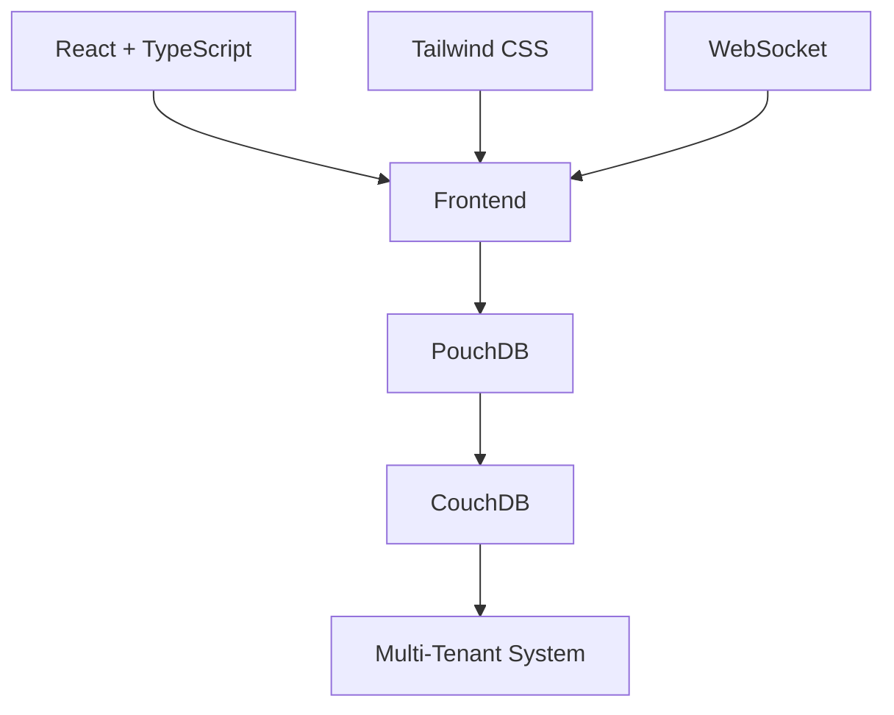
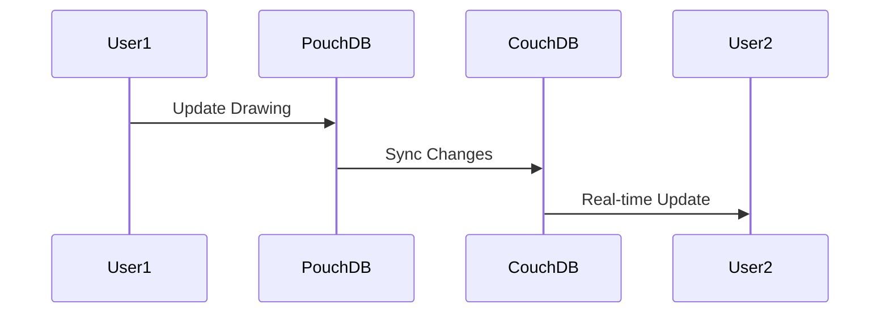
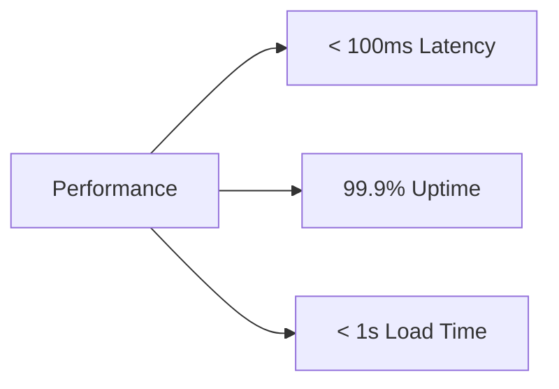

# Building a Real-Time Collaborative Drawing Board
## A Deep Dive into Modern Web Architecture

---

# Agenda
- Introduction & Demo
- Technical Architecture
- Real-Time Collaboration
- Security & Access Control
- Performance Optimizations
- Advanced Features
- Challenges & Solutions
- Future Roadmap

---

# Introduction
## Why Real-Time Collaboration?

- 💡 Instant feedback
- 🤝 Seamless teamwork
- 🌐 Work from anywhere
- 🎨 Creative freedom

---

# Live Demo


---

# Technical Stack Overview


---

# Why This Stack?

| Technology | Benefits |
|------------|----------|
| React + TS | Type safety, Component reuse |
| PouchDB    | Offline-first, Real-time sync |
| Tailwind   | Rapid UI development |
| WebSocket  | Real-time updates |

---

# Data Model
## Board Structure
```typescript
interface Board {
  id: string;
  name: string;
  createdBy: string;
  collaborators: string[];
  isPublic: boolean;
  accessType: 'owned' | 'shared' | 'public' | 'private';
}
```

---

# Real-Time Sync Flow


---

# Multi-Tenant Architecture
## Security First Approach

- 🔐 Tenant Isolation
- 🚦 Access Control
- 🔑 Authentication
- 📝 Audit Trails

---

# Access Control Matrix

| Action | Private | Shared | Public |
|--------|---------|---------|---------|
| View | Owner | Collaborators | Everyone |
| Edit | Owner | Collaborators | None |
| Share | Owner | None | N/A |
| Delete | Owner | None | None |

---

# Performance Optimizations

## Client-Side
- ⚡ Efficient Shape Rendering
- 🎯 Cursor Movement
- 📊 State Management

## Server-Side
- 📝 Query Optimization
- 💾 Data Indexing
- 🔄 Sync Strategies

---

# Advanced Features Demo
## Sharing System

```typescript
// URL-based sharing example
const shareURL = `${baseURL}/board/${boardId}?access=${token}`;
```

---

# Real-Time Drawing Tools


- ✏️ Vector Drawing
- 🎨 Color Picker
- ↩️ Undo/Redo
- 👥 User Presence

---

# Technical Challenges

## Sync Conflicts
```typescript
// Conflict Resolution Strategy
const resolveConflict = async (doc) => {
  const winner = await determineWinner(doc._conflicts);
  return winner;
};
```

---

# UX Challenges & Solutions

| Challenge | Solution |
|-----------|----------|
| Latency | Optimistic Updates |
| Offline Mode | Local-First Data |
| Collaboration | Real-time Indicators |
| Performance | Progressive Loading |

---

# Future Roadmap

- 🤖 AI Features
- 📱 Mobile Apps
- 🎨 Advanced Tools
- 📊 Analytics

---

# Key Metrics


---

# Q&A
## Let's Discuss!

- 💭 Architecture Decisions
- 🛠️ Implementation Details
- 🔮 Future Plans

---

# Resources

- 📚 Documentation: [docs-link]
- 💻 GitHub Repo: [repo-link]
- 📧 Contact: [email]
- 🔗 Demo: [demo-link]

---

# Thank You!
## Start Collaborating Today 